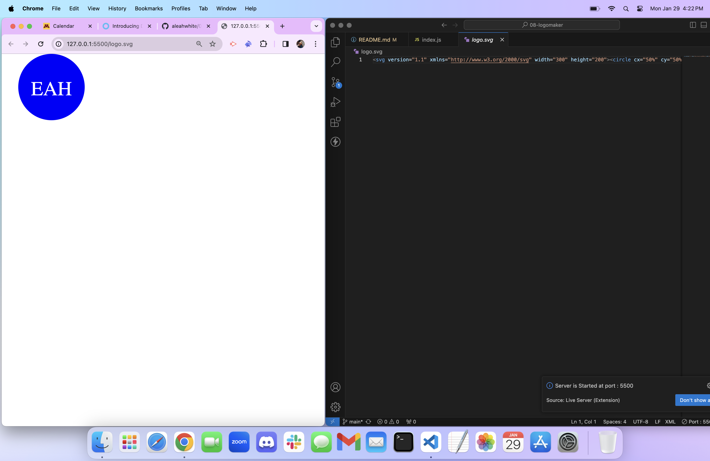

# Challenge 8 - SVG Logo Maker

## Description
This is a command line application written in JavaScript and uses Node.js in the integrated terminal to run. This application generates an logo.svg file that has your own custom logo on it. Choose from 3 shapes, add 3 letters, and choose from endless colors to make your new custom logo YOU!
  
## Table of Contents 
- [Usage](#usage)

- [Credits](#credits)

- [Questions](#questions)

- [License](#license)

## Images/Videos/Links

[Link to walk-through video](https://drive.google.com/file/d/1LdmvWfj6GVfDFehjbPZnmPXzNjMJ42iK/view?usp=sharing)

## Usage
Before using this application, you want to make sure you have Node.js installed on the local machine you will be running it on. If you have Node.js installed, you can use this application by cloning this repository to a folder of your choice, then cd-ing to '07-readmegenerator'(or what you named my repository you cloned). Once onto the repository, use 'code' command to open VSCode (If you don't have the code path installed, manually open VSCode and find the repo in the folder you chose). After you have the file open in VSCode, right-click on the folder and open the integrated terminal. Now to the fun part! In the Integrated terminal run 'npm i' to install the inquirer that's needed. Then run 'node index.js', you will be prompted with 4 simple questions about your logo. After the questions are answered a 'logo.svg' file should appear. Then open the live browser and you will see your logo.
[Link to walk-through video](https://drive.google.com/file/d/1LdmvWfj6GVfDFehjbPZnmPXzNjMJ42iK/view?usp=sharing)
## Credits
n/a

## Questions
If you have any questions/comments about the project, you can email me at [aleahwhite55@gmail.com](mailto:aleahwhite55@gmail.com). For more of my work you can visit my GitHub at [aleahwhite](https://github.com/aleahwhite).

## License
  
This project is licensed under the MIT license. For more information, see the [license page](https://spdx.org/licenses/MIT.html).

